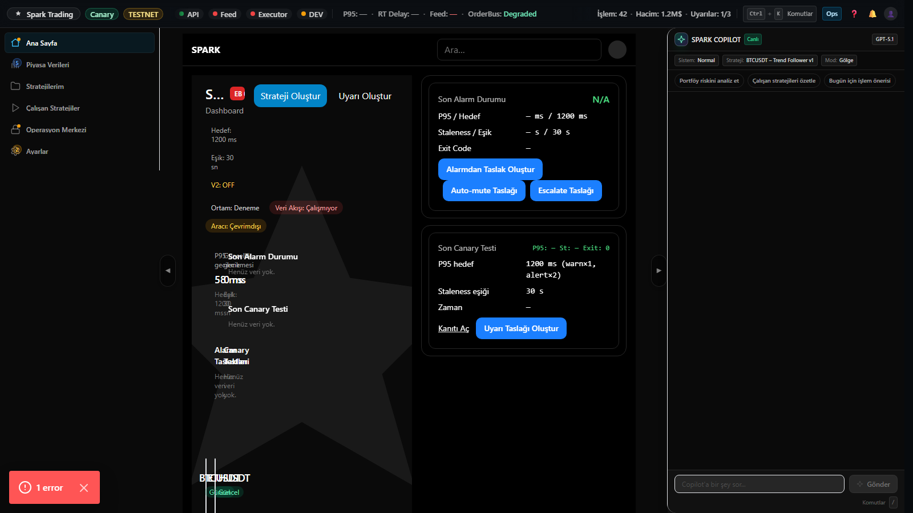

# Dashboard V2 Step 3.2 — Market Sparkline Evidence

## What changed

- Market satırlarına client-side ring buffer ile mini sparkline eklendi.
- Yeni API çağrısı yok; summary polling fiyatlarından besleniyor.
- Seed/Degraded durumunda placeholder çizgi gösteriliyor (UI crash yok).

## Evidence Screenshots

### 1) V2 OFF — Top

### 2) V2 OFF — Scroll

### 3) V2 ON — Overview (Market sparkline görünür)

### 4) V2 ON — Degraded/Seed (fallback)

## Smoke checklist

- V2 ON/OFF switch: OK
- Live → sparkline çiziliyor: OK
- Seed/Degraded → placeholder, crash yok: OK
- Watermark sadece loading/degraded: OK

## Evidence capture helper

- Yeniden üretim: `pnpm -C apps/web-next capture:dashboard-v2-step3-2`
- Not: Script yalnızca kanıt üretimi için mock route kullanır; üretim davranışını etkilemez.

Not: Görseller repo’ya eklendiğinde Step 3.2 evidence tamamdır.

## Test command

- `pnpm -w --filter web-next test:dashboard` ✅
- `pnpm -C apps/web-next build` ⚠️ (PASS with Windows symlink EPERM warnings for standalone copy)
- Not: Windows'ta build sirasinda gorulen EPERM symlink uyariari lokal build'lerde non-fatal kabul edilir.
