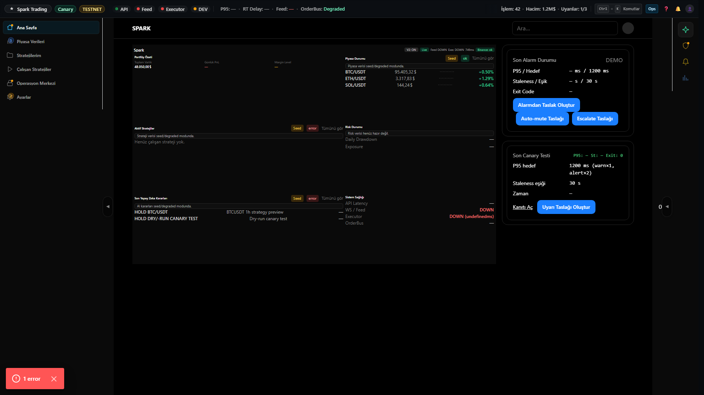
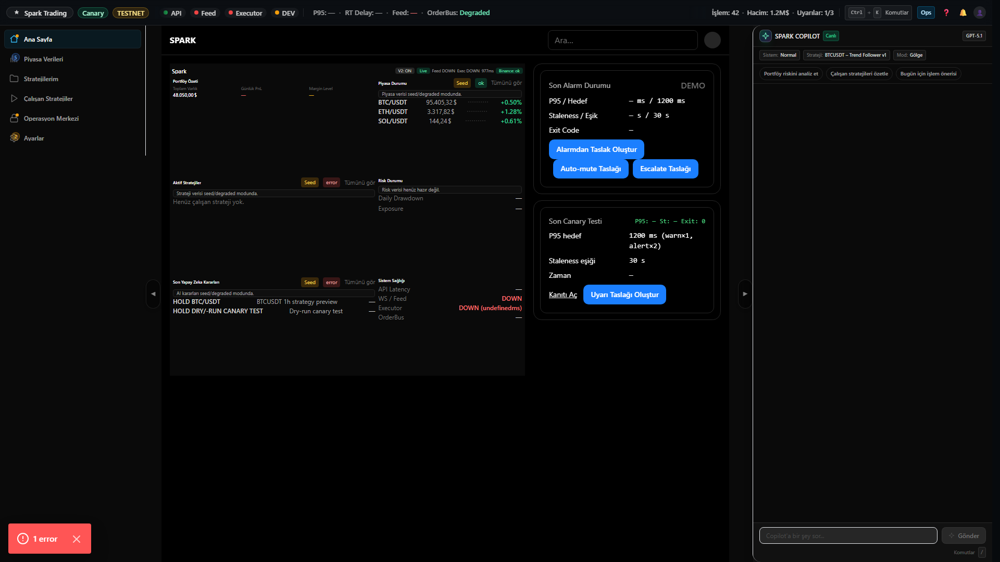

# Dashboard V2 Step 3.3 — Foldless Grid + Live Data Evidence

## What changed
- Dashboard V2 foldless grid: kartlar tek ekrana sığacak şekilde sıkı yoğunlukta düzenlendi.
- Liste limitleri (Market 3, Stratejiler 3, AI Kararları 2) ve "Tümünü gör" linkleri eklendi.
- Canlı veri kaynaklarına bağlanan özetler kullanılıyor; veri yoksa "—" gösteriliyor.

## Evidence Screenshots (1920x1080)
### 1) Right rail kapalı (no-scroll)

### 2) Right rail açık (no-scroll)

## Reproduce (Playwright)
- `pnpm -C apps/web-next capture:dashboard-v2-step3-3`
- Script, `spark.flags.dashboardv2=1` ve `ui.rightRailOpen.v2` localStorage değerlerini set eder.
- Scroll assertion:
  - `main > div` container için `scrollHeight === clientHeight`
  - `documentElement` root için `scrollHeight === clientHeight`

## Pass criteria
- 1920x1080 @100% zoom → Dashboard tek ekranda, dikey scroll yok.
- Right rail açık/kapalı durumda grid fold içinde kalır.
