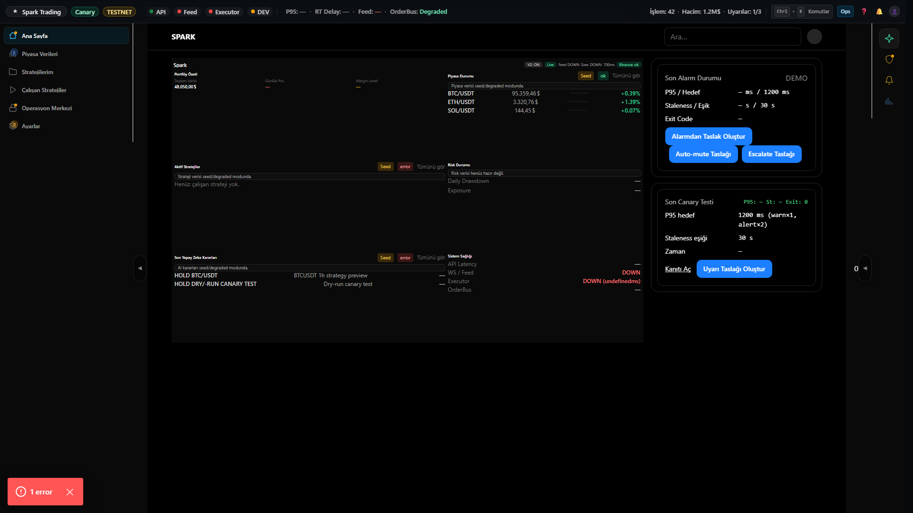
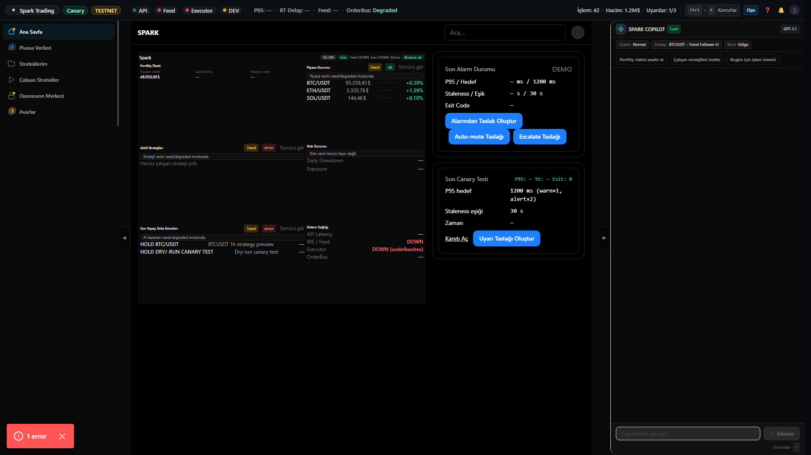

# Dashboard V2 Step 3.4 — AI Decisions Live Evidence

## What changed
- “Son Yapay Zeka Kararları” kartı canlı summary kaynağına bağlandı.
- DEMO/placeholder kaldırıldı; veri yoksa “Henüz karar yok.” boş durumu var.
- Kart satırları 2 item ile sınırlı, tek satır gerekçe + güven yüzdesi.

## Evidence Screenshots (1920x1080)
### 1) Right rail kapalı (no-scroll)

### 2) Right rail açık (no-scroll)

## Reproduce (Playwright)
- `pnpm -C apps/web-next capture:dashboard-v2-step3-4`
- Script:
  - V2 root visible (`dashboard-v2-root`)
  - No-scroll assertion (dashboard root vs container)
  - AI Decisions kartı görünür (`ai-decisions-card`)
  - DEMO metni yok

## Pass criteria
- 1920x1080 @100% zoom → dashboard no-scroll (right rail kapalı/açık).
- AI decisions kartında ya en az 1 item ya da “Henüz karar yok.” görünür.
