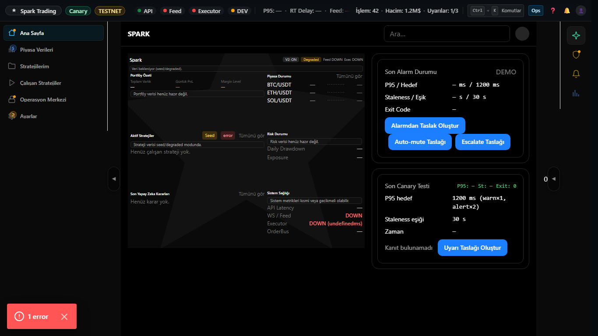
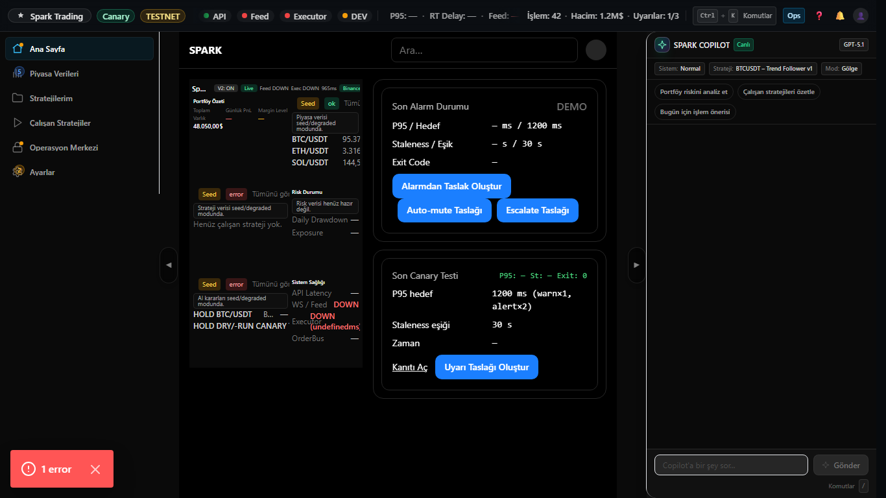

# Dashboard V2 Step 3.5 — Fold 1366x768 Evidence

## What changed
- Kısa yükseklik için compact density (padding/typography) sıkılaştırıldı.
- Dashboard listeleri limitli kalır; no-scroll korunur.

## Evidence Screenshots (1366x768)
### 1) Right rail kapalı (no-scroll)

### 2) Right rail açık (no-scroll)

## Reproduce (Playwright)
- `pnpm -C apps/web-next capture:dashboard-v2-step3-5`
- Script:
  - V2 root visible (`dashboard-v2-root`)
  - No-scroll assertion (dashboard root vs container)
  - AI Decisions kartı görünür (`ai-decisions-card`)
  - DEMO metni yok

## Pass criteria
- 1366x768 @100% zoom → dashboard no-scroll (right rail kapalı/açık).
- AI decisions kartında en az 1 item veya “Henüz karar yok.” görünür.
