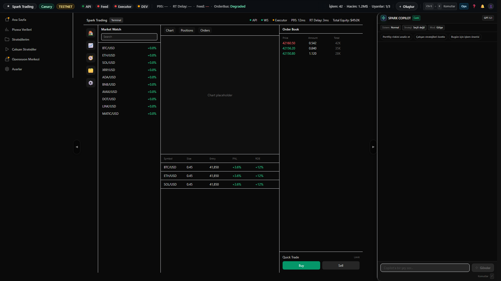
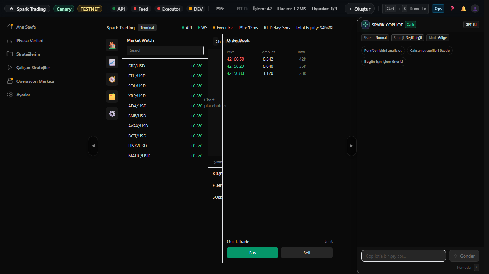

# Terminal Step T1 — Layout Skeleton Evidence

## What changed
- Terminal ana düzeni: topbar + ikon sidebar + market watch + workspace + right panel.
- Root scroll yok; panel içlerinde kontrollü overflow.

## Evidence Screenshots
### 1) 1920x1080 (right panel açık)

### 2) 1366x768 (right panel kapalı)

## Reproduce (Playwright)
- `pnpm -C apps/web-next capture:terminal-step-t1`
- Assertions:
  - `terminal-root` görünür
  - Root no-scroll
  - Panel testid’ler görünür

## Pass criteria
- 1920x1080: root scroll yok (paneller görünüyor).
- 1366x768: right panel kapalı, root scroll yok.
