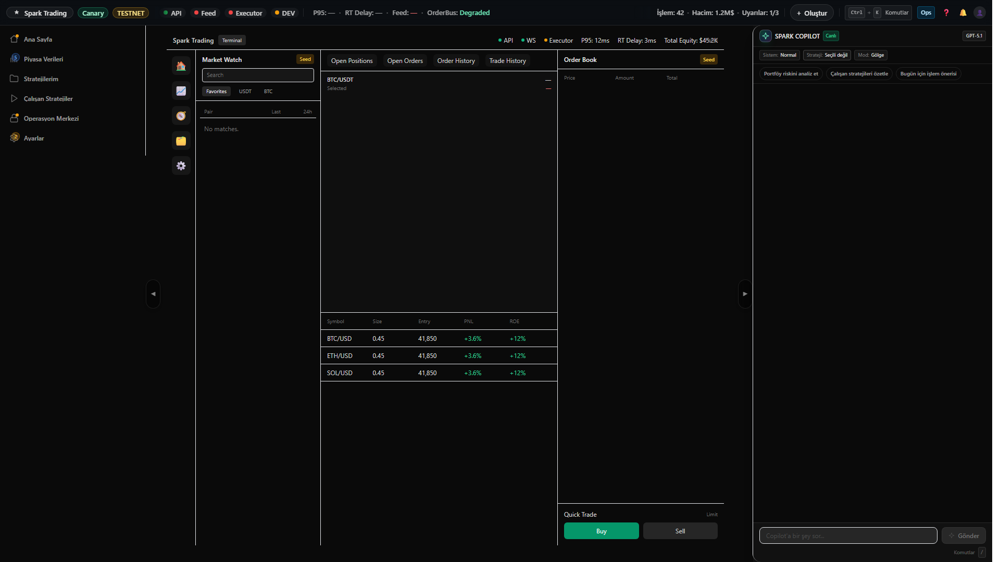
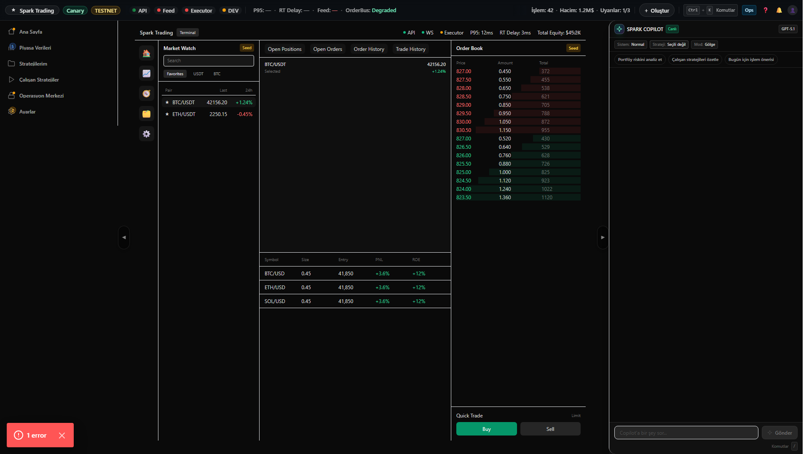
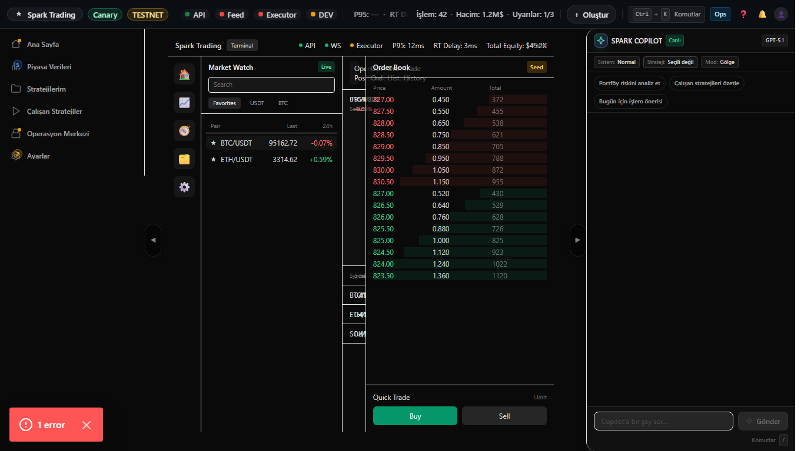

# Terminal Step T2 — MarketWatch + Selection + OrderBook Wiring

## What changed
- MarketWatch canlı/seed tickers ile doluyor (pair, last, 24h%).
- Sembol seçimi workspace header ve order book’u güncelliyor.
- Seed/Live badge görünür, seed durumunda UI crash yok.

## Evidence Screenshots
### 1) 1920x1080 — BTC seçili

### 2) 1920x1080 — ETH seçili

### 3) Seed badge (forced)

### 4) 1366x768 — right panel kapalı

## Reproduce (Playwright)
- `pnpm -C apps/web-next capture:terminal-step-t2`
- Assertions:
  - `terminal-root` görünür
  - Root no-scroll
  - MarketWatch görünür

## Pass criteria
- 1920x1080: BTC/ETH seçimi UI’ı değiştirir.
- Seed modunda badge görünür.
- 1366x768: right panel kapalı, root scroll yok.
